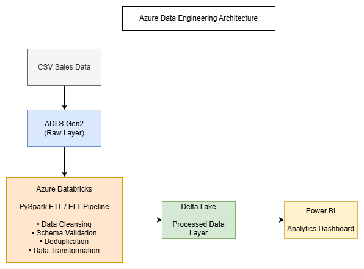
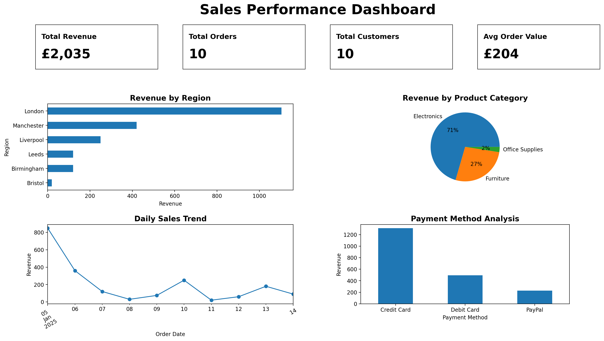

# Azure Data Platform Project

## Overview
This project demonstrates an end-to-end cloud data engineering pipeline using Azure-style architecture, PySpark, Delta Lake, and Power BI-ready data modelling.

The goal is to showcase production-style data engineering skills including ingestion, transformation, validation, and loading into an analytics-ready data layer.

## Architecture


## Power BI Dashboard




```
CSV Source
   ↓
Raw Data Layer
   ↓
PySpark Transformation
   ↓
Data Quality Validation
   ↓
Delta Lake Processed Layer
   ↓
Power BI Reporting Layer


```

## Tech Stack
- Azure Databricks
- PySpark
- Delta Lake
- ADLS Gen2
- Azure Data Factory
- Power BI
- Python
- SQL

## Key Features
- Batch data ingestion from CSV
- Schema inference
- Data cleansing and duplicate removal
- Date parsing and data type casting
- Data quality validation
- Delta Lake output
- Power BI-ready processed layer

## Business Use Case
The pipeline processes sales transaction data and prepares it for business reporting.

The final dataset can support dashboards showing:
- Revenue by region
- Sales by product category
- Payment method trends
- Daily sales performance
- Customer purchasing patterns

## Repository Structure

```text
azure-data-platform/
├── data/
│   ├── raw/
│   └── processed/
├── notebooks/
├── pipelines/
│   └── etl_pipeline.py
├── src/
├── tests/
├── docs/
├── powerbi/
├── requirements.txt
└── README.md
```

## Pipeline Logic
The PySpark ETL pipeline performs:

1. Extract sales data from raw CSV
2. Infer schema automatically
3. Remove duplicate orders
4. Convert order dates to date format
5. Cast quantity and price fields to numeric types
6. Remove invalid records
7. Add load timestamp
8. Write processed data to Delta format

## Status
In progress — portfolio project for Senior Data Engineer roles.
