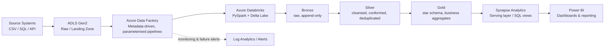

# Azure Enterprise Lakehouse Platform

[](https://github.com/Kornelius99/azure-data-platform/actions/workflows/ci.yml)

An end-to-end, production-style Azure data platform built around the medallion (bronze/silver/gold) lakehouse pattern. It demonstrates the full lifecycle a Senior Data Engineer owns in real enterprise environments: metadata-driven ingestion, PySpark/Delta Lake transformation on Databricks, a curated serving layer for BI, automated data quality checks, CI/CD, and infrastructure as code.

## Why this project

Most portfolio ETL projects stop at "read a CSV, clean it, write a table." This one is built to mirror how a real Azure lakehouse platform is engineered day to day, including the parts that are easy to skip: orchestration, parameterisation, data quality gates, testing, and repeatable infrastructure.

## Architecture



**Flow summary:** ADF triggers metadata-driven Copy activities that land raw files into ADLS Gen2, then calls parameterised Databricks notebooks that promote data through bronze, silver and gold layers using PySpark and Delta Lake. Synapse exposes the gold layer as SQL views for Power BI. Every stage is monitored, with pipeline failures alerting the team. See [docs/ARCHITECTURE.md](docs/ARCHITECTURE.md) for the detailed design notes and [docs/DATA_QUALITY_FRAMEWORK.md](docs/DATA_QUALITY_FRAMEWORK.md) for the quality gate design.

## Tech stack

- **Orchestration:** Azure Data Factory (parameterised, metadata-driven pipelines), scheduling & failure alerting
- **Compute:** Azure Databricks, PySpark, Spark SQL
- **Storage:** ADLS Gen2, Delta Lake (bronze / silver / gold)
- **Serving:** Azure Synapse Analytics, Power BI
- **Quality & testing:** custom PySpark data quality framework, PyTest
- **DevOps:** GitHub Actions CI/CD, Terraform (IaC), Docker
- **Languages:** Python, PySpark, SQL, HCL (Terraform), JSON (ADF ARM-style pipeline defs)

## Repository structure

```text
azure-data-platform/
├── adf/                        # ADF pipeline/dataset definitions (metadata-driven ingestion)
│   └── pipelines/
├── notebooks/                  # Databricks notebooks: bronze -> silver -> gold
├── src/
│   ├── ingestion/               # ADLS readers / schema handling
│   ├── transformation/          # Silver/gold transformation logic
│   ├── loading/                 # Delta Lake writers (merge/upsert, partitioning)
│   └── data_quality/            # Reusable PySpark data quality framework
├── tests/                      # PyTest unit tests
├── infra/terraform/             # Azure infrastructure as code
├── .github/workflows/           # CI/CD pipeline
├── docs/                       # Architecture & data quality documentation
├── powerbi/                     # Power BI assets
├── requirements.txt
└── README.md
```

## Medallion layers

- **Bronze** – raw, append-only ingestion from ADLS landing zone with ingestion metadata (source file, load timestamp, batch id) preserved for lineage and replay.
- **Silver** – schema enforcement, deduplication, type casting, null/invalid record handling, and conformance to shared business definitions.
- **Gold** – star-schema fact and dimension tables optimised for Power BI/Synapse consumption, with partitioning and Z-ORDER tuning applied to the largest fact tables.

## Data quality framework

A reusable PySpark data quality module (`src/data_quality/checks.py`) runs completeness, uniqueness, referential integrity, and freshness checks at each layer boundary, producing a quality report that can gate downstream loads and feed lineage/governance documentation. See [docs/DATA_QUALITY_FRAMEWORK.md](docs/DATA_QUALITY_FRAMEWORK.md).

## CI/CD

GitHub Actions (`.github/workflows/ci.yml`) lints the codebase (flake8/black), runs the PyTest suite on every push and pull request, and is structured so a deployment job can be added to promote notebooks/pipelines to higher environments via Azure DevOps in a real deployment.

## Infrastructure as code

`infra/terraform/main.tf` provisions the core Azure footprint for this platform: a resource group, an ADLS Gen2-enabled storage account, an Azure Data Factory instance, and an Azure Databricks workspace, so the environment is reproducible rather than click-ops.

## Running locally

```bash
python -m venv .venv && source .venv/bin/activate
pip install -r requirements.txt
pytest tests/ -v
spark-submit notebooks/databricks_medallion_pipeline.py
```

## Business use case

The pipeline processes sales transaction data end to end into an analytics-ready gold layer supporting revenue analysis by region, product category insights, payment method analysis, daily sales trends, and customer purchasing behaviour, published through Power BI.

## Engineering concepts demonstrated

ETL/ELT pipeline design · medallion lakehouse architecture · metadata-driven orchestration · Delta Lake merge/upsert patterns · Spark performance tuning (partitioning, Z-ORDER, broadcast joins) · data quality and lineage · CI/CD · infrastructure as code · production-style repository structuring.

## Future enhancements

- Incremental/CDC ingestion via ADF watermarking
- Streaming ingestion path (Structured Streaming / Event Hubs)
- Great Expectations integration alongside the custom quality framework
- Unity Catalog governance model

## Author

**Korneli Pingula** — Senior Data Engineer | Azure • AWS • Databricks • PySpark • SQL • Power BI

[LinkedIn](https://linkedin.com/in/pingulakornelius) · [GitHub](https://github.com/Kornelius99)
